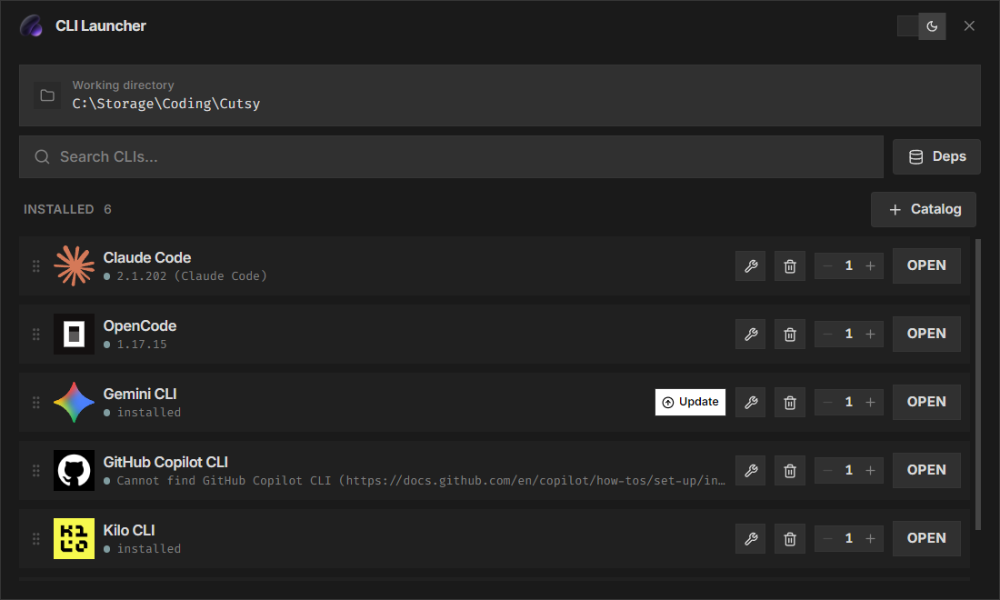

<div align="center">

# CLI Launcher

Cross-platform desktop launcher for AI coding CLIs. Install, update, uninstall, and launch 32 terminal AI agents — all from one mac-style panel.

<!-- Badges -->
<picture><source media="(prefers-color-scheme: dark)" srcset="https://www.shieldcn.dev/github/stars/MadBlast0/Cli-launcher.svg?variant=secondary&amp;size=sm&amp;mode=dark"></picture>
<picture><source media="(prefers-color-scheme: dark)" srcset="https://www.shieldcn.dev/github/forks/MadBlast0/Cli-launcher.svg?variant=secondary&amp;size=sm&amp;mode=dark"></picture>
<picture><source media="(prefers-color-scheme: dark)" srcset="https://www.shieldcn.dev/github/release/MadBlast0/Cli-launcher.svg?size=sm&amp;mode=dark"></picture>
<picture><source media="(prefers-color-scheme: dark)" srcset="https://www.shieldcn.dev/github/ci/MadBlast0/Cli-launcher.svg?variant=secondary&amp;size=sm&amp;mode=dark"></picture>
<picture><source media="(prefers-color-scheme: dark)" srcset="https://www.shieldcn.dev/github/license/MadBlast0/Cli-launcher.svg?variant=ghost&amp;size=sm&amp;mode=dark"></picture>
<picture><source media="(prefers-color-scheme: dark)" srcset="https://www.shieldcn.dev/badge/Language-TypeScript-3178C6.svg?logo=typescript&amp;variant=branded&amp;size=sm&amp;mode=dark"></picture>
<picture><source media="(prefers-color-scheme: dark)" srcset="https://www.shieldcn.dev/badge/Stack-React-61DAFB.svg?logo=react&amp;variant=branded&amp;size=sm&amp;mode=dark"></picture>
<picture><source media="(prefers-color-scheme: dark)" srcset="https://www.shieldcn.dev/badge/Bundler-Vite-646CFF.svg?logo=vite&amp;variant=branded&amp;size=sm&amp;mode=dark"></picture>
<picture><source media="(prefers-color-scheme: dark)" srcset="https://www.shieldcn.dev/badge/Stack-Tailwind_CSS-06B6D4.svg?logo=tailwindcss&amp;variant=branded&amp;size=sm&amp;mode=dark"></picture>

<!-- Downloads -->
<p>
  <a href="https://github.com/MadBlast0/Cli-launcher/releases/latest"></a>&nbsp;
  <a href="https://github.com/MadBlast0/Cli-launcher/releases/latest"></a>&nbsp;
  <a href="https://github.com/MadBlast0/Cli-launcher/releases/latest"></a>
</p>

</div>



## Supported CLIs

| CLI | Package | Type |
| --- | ------- | ---- |
| Claude Code | `@anthropic-ai/claude-code` | node |
| OpenCode | `opencode-ai` | node |
| Gemini CLI | `@google/gemini-cli` | node |
| GitHub Copilot CLI | `@github/copilot` | node |
| Codex CLI | `@openai/codex` | node |
| Aider | `aider-chat` | python |
| Kilo CLI | `@kilocode/cli` | node |
| Qwen Code | `@qwen-code/qwen-code` | node |
| Codebuff | `codebuff` | node |
| Goose CLI | `—` | standalone |
| PI Coding Agent | `@mariozechner/pi-coding-agent` | node |
| Crush | `@charmland/crush` | node |
| Freebuff | `freebuff` | node |
| Command Code | `command-code` | node |
| Cursor CLI | `—` | standalone |
| Amp CLI | `@ampcode/cli` | node |
| Amazon Q Developer CLI | `—` | standalone |
| Cline | `cline` | node |
| Cody CLI | `@sourcegraph/cody` | node |
| Open Interpreter | `open-interpreter` | python |
| OpenHands CLI | `openhands-ai` | python |
| Plandex | `—` | standalone |
| Continue CLI | `@continuedev/cli` | node |
| Droid (Factory) | `—` | standalone |
| Auggie | `@augmentcode/auggie` | node |
| Grok CLI | `@vibe-kit/grok-cli` | node |
| Mods | `—` | standalone |
| aichat | `—` | standalone |
| gptme | `gptme` | python |
| Shell-GPT | `shell-gpt` | python |
| RA.Aid | `ra-aid` | python |
| Fabric | `—` | standalone |

## Features

- **32 AI coding CLIs** — manage all major terminal AI agents (Claude Code, OpenCode, Gemini CLI, GitHub Copilot, Aider, and more) in one place.
- **Install / Update / Uninstall / Repair** — per-CLI actions with real-time progress feedback. Each CLI gets its own install script generated dynamically for your platform.
- **Multi-terminal launch** — open 1–9 terminal instances per CLI, pre-configured in your chosen working directory. Supports cmd, PowerShell, Windows Terminal, iTerm, Warp, GNOME Terminal, Konsole, Alacritty, and more. WSL-aware for cross-platform workflows.
- **YOLO Mode** — toggle to auto-append `--dangerously-skip-permissions` (or equivalent) to supported CLIs, bypassing approval prompts for fully autonomous operation.
- **Favorites** — mark CLIs as favorites to pin them to the top of the grid for quick access.
- **Keyboard shortcuts** — `Ctrl+F` to search, `Ctrl+D` for dependency manager, `Ctrl+1–9` to launch the Nth installed CLI.
- **Right-click context menu** — open a CLI's homepage, copy its install command, or launch it directly.
- **Catalog browser** — discover and install new CLIs from a searchable catalog grouped by package manager (npm, pip, standalone). Batch-install all uninstalled CLIs with one click.
- **Update detection** — checks npm/pip for newer versions (cached 1 hour) and badges each CLI when an update is available.
- **Drag to reorder** — rearrange CLI cards to your preference; layout commits only on drop and persists across sessions.
- **Auto-update** — checks for new GitHub releases in the background. Download progress shown inline; restart with one click.
- **Dependency manager** — detects installed Node.js and Python versions. If missing, downloads and silently installs the appropriate runtime for your platform.
- **System tray** — minimizes to the system tray on close. Double-click the tray icon to restore the window.
- **Toast notifications** — real-time success, error, and info toasts for every action.
- **CLI status cache** — instant first paint with cached state, then background refresh per-CLI for up-to-date version and availability info.
- **Security** — strict Content Security Policy in production builds, IPC input validation, path traversal protection, and shell-injection safeguards.
- **Cross-platform** — Windows (`.ps1` scripts), macOS & Linux (`.sh` scripts). Packaged as native installers for each OS.

## Installation

Download the latest release for your platform from the [Releases page](https://github.com/MadBlast0/Cli-launcher/releases/latest).

| Platform | Format | Arch |
| -------- | ------ | ---- |
| Windows | `.msi` installer | x64 |
| Windows | `.exe` installer (NSIS) | x64 |
| Windows | Portable `.exe` | x64 |
| macOS | `.dmg` (universal) | x64 + arm64 |
| macOS | `.dmg` (x64) | x64 |
| macOS | `.dmg` (arm64) | arm64 |
| macOS | `.zip` (universal) | x64 + arm64 |
| Linux | `.AppImage` | x64, arm64 |
| Linux | `.deb` | x64, arm64 |
| Linux | `.rpm` | x64, arm64 |
| Linux | `.tar.gz` | x64, arm64 |

Builds are automatically produced by GitHub CI when a new version tag is pushed.

## Stack

- **Electron** 33 — desktop shell
- **React** 19 + **TypeScript** — renderer UI
- **Vite** 6 — build tool
- **Tailwind CSS** 4 — styling
- **electron-builder** 25 — packaging

## Development

```bash
git clone https://github.com/MadBlast0/Cli-launcher.git
cd Cli-launcher
npm install
npm run dev
```

## Build

Build artifacts are output to the `release/` directory.

```bash
npm run build          # current platform
npm run build:win      # Windows (MSI, NSIS, portable, ZIP)
npm run build:mac      # macOS (DMG, ZIP — universal, x64, arm64)
npm run build:linux    # Linux (AppImage, deb, rpm, tar.gz)
npm run build:all      # all platforms
```

## CI/CD

Pushing a tag matching `v*.*.*` (e.g. `v0.0.2`) triggers a build on Windows, macOS, and Linux and publishes a [GitHub Release](https://github.com/MadBlast0/Cli-launcher/releases) with all platform builds attached.

The macOS universal binaries (fat binaries containing both x64 and arm64 slices) are produced automatically using `electron-builder --universal`, so a single download works on both Intel and Apple Silicon Macs.

## Star History

[](https://www.star-history.com/?repos=MadBlast0%2FCli-launcher&type=timeline&legend=bottom-right)

## License

MIT
